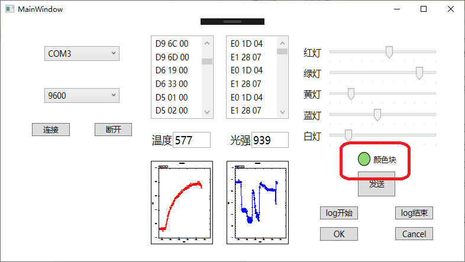

## 功能概述  
1. 界面的控件能随主界面的改变调整大小和位置；  
2. 能够获取并连接计算机的所有端口；  
3. 能通过MIDI协议与Arduino进行通讯；  
4. 能在PC端显示十六进制通信数值、物理值和实时图形曲线；  
5. 能控制Arduino板上PWM输出端，对LED明暗进行控制；  
6. 能够以xml格式记录MIDI数据的结果；  
## 项目特色  
1. 能改变Arduino板上LED的亮度  
2. 能显示RGB颜色块  
3. 能显示发送和接收到的MIDI数据  
## 代码总量  
大约400行  
## 工作时间  
三天  
## 结论  
### 1.1项目名称：  
GUI界面布局的设计  
### 1.2操作步骤：  
使用WPF控件完成界面的设计，并通过一个具有Stretch=“Fill”属性的ViewBox使得界面上的所有控件的大小会随着主窗口的拉伸而拉伸，且保持相对位置不变；  
### 1.3实际结果描述、结论：  
当拉伸窗口或最大化窗口时，窗口内所有控件能够自动调整自身的大小和位置以适应窗口，如图：  
拉伸前：  
   
拉伸后：  
   

### 2.1项目名称：  
串口名及波特率的选择  
### 2.2操作步骤：  
使用两个combobox控件用以选择串口名及波特率。其中串口名通过使用C#中SerialPort类的GetPortNames()方法取得；  
### 2.3实际结果描述、结论：  
当下拉窗口上的combobox控件时，可以选择连接的串口和波特率，如图：  
   
   

### 3.1项目名称：  
发送的数据和返回的实时信息的显示  
### 3.2操作步骤：  
使用两个ListView控件用以实现该功能，当有Arduino和PC间的数据传输时，将传输的Midi格式数据处理成字符串显示在ListView中；  
### 3.3实际结果描述、结论：  
当有数据传输时，PC接收到的数据显示在右边的ListView中，发送的数据显示在左边的ListView中，如图：  
   
存在的问题：ListView不能自动下滑以显示最新传输的消息，需要手动下拉滚动条查看最近传输的消息；  

### 4.1项目名称：  
显示温度光强的变化曲线  
### 4.2操作步骤：  
使用ZedGraph控件以实现该功能；  
### 4.3实际结果描述、结论：  
当连接上Arduino后，左边显示温度的变化曲线，右边显示光强的变化曲线，如上图所示。  

### 5.1项目名称：  
滑块控制LED灯的亮度  
### 5.2操作步骤：  
实验中发现滑块的Value是一个10以内的double，将value处理成范围为0-255的byte类型后以Midi格式传输到Arduino；   
### 5.3实际结果描述、结论：  
连接上Arduino后，当移动滑块时，Arduino上对应的灯的亮度改变，端口接收到的信号范围是0-255；  

### 6.1项目名称：  
颜色块的实现  
### 6.2操作步骤：  
使用Ellipse控件完成该功能。当Slider的value发生变化时，通过各个Slider的value值计算RGB值并更新Ellipse的Fill属性以达到显示RGB混合色的效果；   
### 6.3实际结果描述、结论：  
连接上Arduino后，当移动滑块时，颜色块的RGB混合色能够灵敏的变化并显示出当前所有LED亮度值所对应的混合色，如图：  
   

### 7.1项目名称：  
Log的存储  
### 7.2操作步骤：  
使用两个List来存储程序运行中发送和接收到的Midi消息，当用户点击了OK后，开始存储log到List中，当用户点击了Cancel时，将List清空，当点击了Log结束按钮时，将List的数据取出以Xml格式存储在硬盘上；  
### 7.3实际结果描述、结论：  
程序运行一段时间并点击结束后，PC发送和接收的log均存储在了指定的Xml文件中，如图：  
   